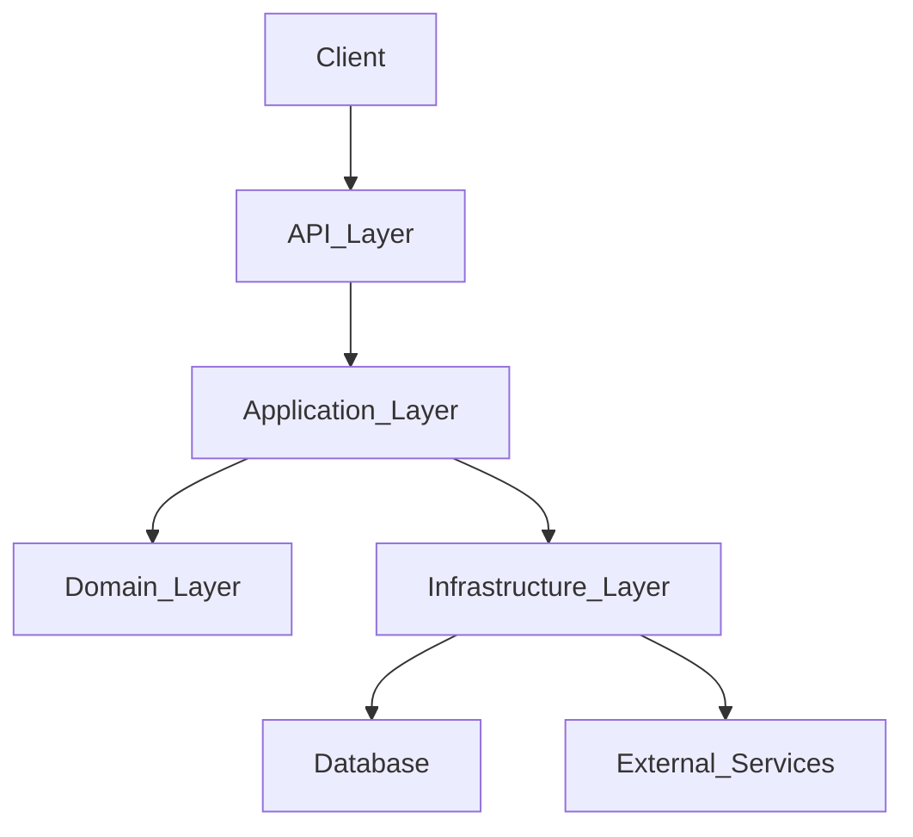

# Architecture Document

> This document defines the system boundaries, layer responsibilities, and dependency flows for this project.

---

## 1. High-Level Architecture

---

## 2. Layer Responsibilities

### 2.1 API Layer
- **Responsibility:** Request parsing, response formatting, authentication, and validation.
- **Forbidden:** Business logic, direct database access.

### 2.2 Application Layer
- **Responsibility:** Use case orchestration, workflow coordination, and transaction handling.
- **Forbidden:** Core domain rules, infrastructure-specific implementations.

### 2.3 Domain Layer
- **Responsibility:** Core business logic, domain entities, and domain rules.
- **Forbidden:** Infrastructure dependencies, framework-specific code. This layer must remain pure.

### 2.4 Infrastructure Layer
- **Responsibility:** Database access (repositories), cache management, external API integrations, and messaging systems.
- **Rule:** Should implement interfaces defined by the Application or Domain layers.

---

## 3. Communication Patterns

- **Synchronous:** REST APIs for client-facing communication.
- **Asynchronous:** Event-driven communication (e.g., message queues) for long-running tasks or decoupling services.

---

## 4. Data Flow

1. Request enters the **API Layer** (validation & auth).
2. Passed to the **Application Layer** (use case orchestration).
3. **Application Layer** interacts with the **Domain Layer** to apply business rules.
4. **Application Layer** interacts with the **Infrastructure Layer** to persist state or fetch data.
5. Response flows back up to the client.
